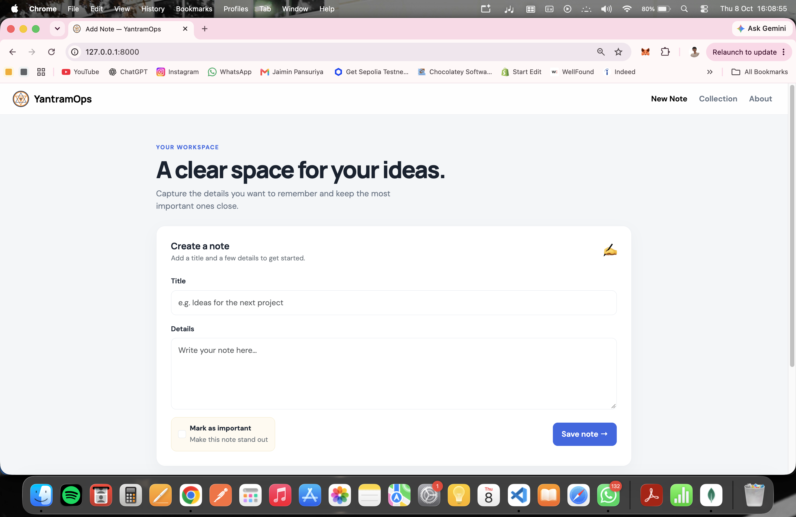
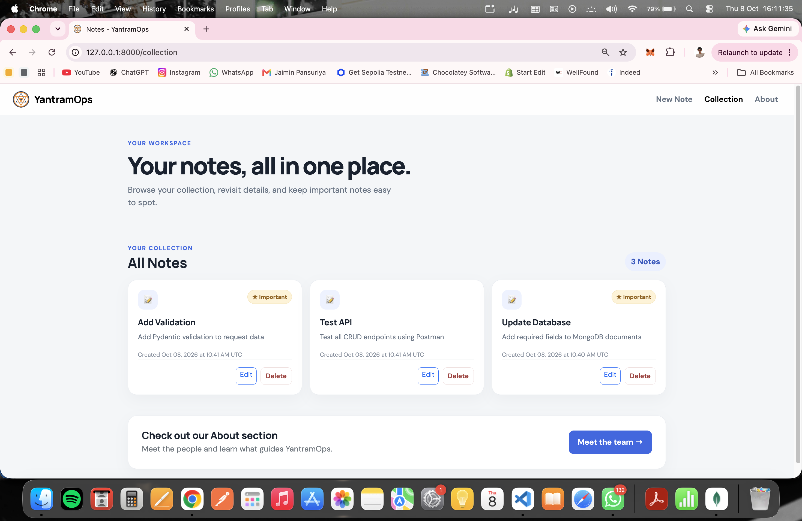
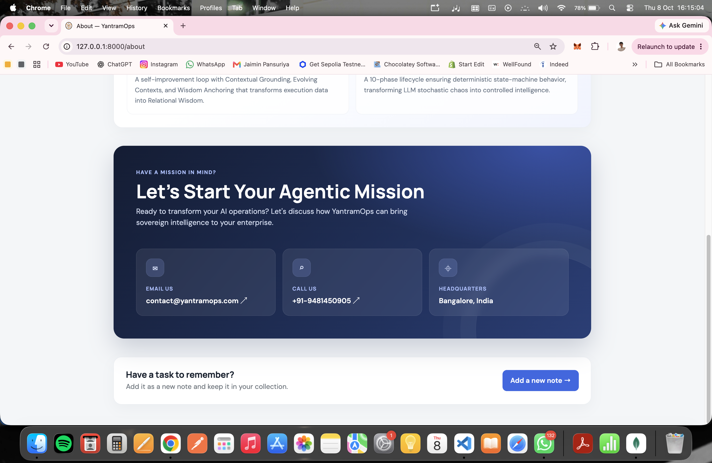

# YantramOps Notes

YantramOps Notes is a server-rendered note-taking app built with FastAPI, Jinja2, and MongoDB. Create, browse, edit, and delete notes, mark important notes, and learn about the YantramOps mission on the About page.

## UI screenshots

The screenshots below show the app's About page, note collection, and note creation page.

### Add a note



### Note collection



### About page — mission


### About page — contact




## Features

- Create notes with a title and description.
- Mark notes as important and edit their content later.
- Browse notes by creation time, with creation and last-updated timestamps shown in UTC.
- Delete notes after confirming the action.
- View the YantramOps mission and contact information on the About page.
- Use the responsive interface on desktop and mobile.

## Pages and routes

| Method | Path | Description |
| --- | --- | --- |
| `GET` | `/` | Display the form for creating a note. |
| `POST` | `/` | Save a note and redirect to the collection. |
| `GET` | `/collection` | Display saved notes and their actions. |
| `GET` | `/about` | Display the mission, principles, and contact information. |
| `GET` | `/notes/{note_id}/edit` | Display the edit form for a note. |
| `POST` | `/notes/{note_id}/edit` | Save note changes and redirect to the collection. |
| `DELETE` | `/notes/{note_id}` | Delete a note; returns `204 No Content` on success. |

FastAPI's interactive API documentation is available at `/docs` and `/redoc` while the app is running.

## Technology

- Python with FastAPI and Uvicorn
- MongoDB with PyMongo
- Jinja2 templates
- HTML, CSS, Bootstrap 5.3, and vanilla JavaScript

Bootstrap and Google Fonts are loaded from external CDNs, so the browser needs internet access to display them.

## Requirements

- Python 3.10 or newer
- MongoDB running locally or an accessible MongoDB Atlas cluster
- Internet access for externally hosted fonts and Bootstrap styling

## Install

Run these commands from the `YantramOps_Intern_Task_FastAPI` directory.

```bash
python3 -m venv venv
source venv/bin/activate
python -m pip install --upgrade pip
python -m pip install fastapi uvicorn pymongo jinja2
```

On Windows PowerShell, activate the environment with:

```powershell
venv\Scripts\Activate.ps1
```

The repository does not currently include a dependency lockfile or `requirements.txt`; the command above installs the app's direct runtime dependencies.

## Configure MongoDB

By default, the app connects to the local MongoDB server at `mongodb://localhost:27017`. Set `MONGO_URL` before launching the app to use another MongoDB URI:

```bash
export MONGO_URL='mongodb+srv://<username>:<password>@<cluster-host>/<database>?retryWrites=true&w=majority'
```

Replace the placeholders with your connection details. Keep credentials out of source control. The app reads `MONGO_URL` from the process environment and does not load a `.env` file automatically.

Notes are stored in the `NotesDB` database, in the `notes` collection. MongoDB creates these when the first note is saved.

## Run the app

Start Uvicorn from the project directory so the relative `templates/` and `static/` paths resolve correctly:

```bash
uvicorn index:app --reload
```

Then open <http://127.0.0.1:8000>.

## Project structure

```text
YantramOps_Intern_Task_FastAPI/
├── config/
│   └── db.py                 # MongoDB connection
├── models/
│   └── note/model.py         # Note model
├── routes/
│   └── note/route.py         # Page and note routes
├── schemas/
│   └── note/schema.py        # MongoDB serialization helpers
├── screenshots/              # UI screenshots included below
├── static/                   # Site assets
├── templates/
│   ├── index.html            # Create note page
│   ├── collection.html       # Notes collection
│   ├── edit_note.html        # Edit note page
│   └── about.html            # Mission and contact page
└── index.py                  # FastAPI application entry point
```

The `models/` and `schemas/` modules are present for the note data shape and serialization helpers; current route handlers work directly with PyMongo documents.

## Note data

Each note is stored as a MongoDB document with these fields:

| Field | Type | Description |
| --- | --- | --- |
| `_id` | `ObjectId` | MongoDB-generated identifier. |
| `title` | String | Note title; required by the create and edit forms. |
| `desc` | String | Note description; required by the create and edit forms. |
| `important` | Boolean | Whether the note is marked important. |
| `created_at` | UTC date | Creation time. |
| `updated_at` | UTC date, optional | Last edit time. |

The collection view can display older documents without `created_at` by using the timestamp embedded in their MongoDB `ObjectId`. It also accepts the legacy `note` field as a title when `title` is absent.

## Troubleshooting

- **Cannot connect to MongoDB:** Start your local MongoDB service or check the `MONGO_URL`, Atlas network access rules, and database credentials.
- **Templates or images are missing:** Run Uvicorn from the project directory.
- **Missing Python module:** Activate the virtual environment and install the dependencies listed above.
- **Styling or fonts are missing:** Check that the browser can reach the Bootstrap and Google Fonts CDNs.

## Security

This is a demo app without user authentication, authorization, or CSRF protection. Add appropriate protections before exposing it publicly or using it with sensitive notes.
